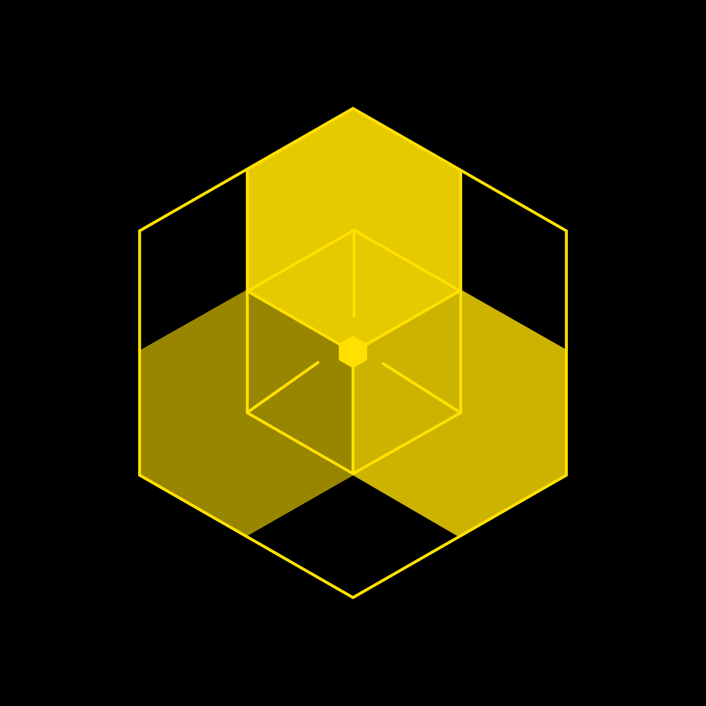
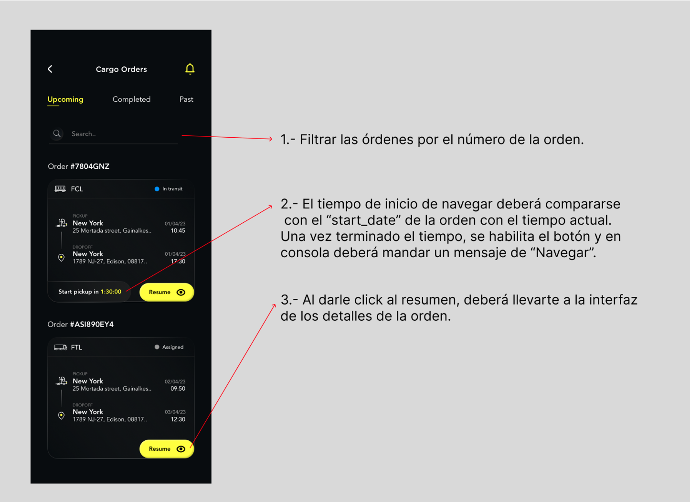
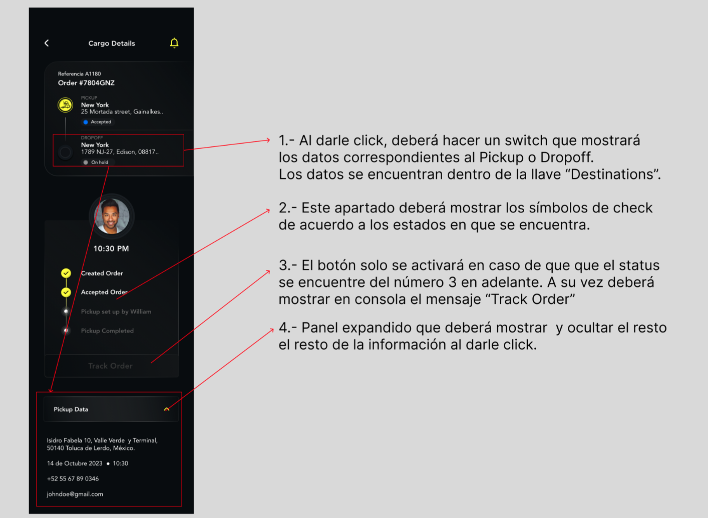

# &middot; Examen de Evaluación para el Puesto de Front-End &middot; 

Como parte de tu proceso de selección, recibirás una prueba diseñada para evaluar tu experiencia en la maquetación de interfaces y tu nivel de programación de componentes requeridos.

## Instrucciones

1. **Maquetado de Interfaces**  
   Deberás implementar las interfaces enviadas, utilizando datos obtenidos a través de peticiones a una API REST. Los assets necesarios estarán disponibles en un archivo de Figma.

   ### Enlace a la Maqueta:
   [Figma - Prueba Front-End](https://www.figma.com/design/a3ZLOVSXnQliLKNloQoXN1/Prueba-Devs?node-id=0-1&t=X0XF6OQZqiBiTN8Z-1)

2. **Peticiones API**  
   Para alimentar las interfaces, utiliza los siguientes endpoints:  
   - **Pedidos próximos:**  
     `https://129bc152-6319-4e38-b755-534a4ee46195.mock.pstmn.io/orders/upcoming`  
   - **Todos los pedidos:**  
     `https://129bc152-6319-4e38-b755-534a4ee46195.mock.pstmn.io/orders`

## Evaluación y Entrega

1. **Criterios de Evaluación**  
   Se evaluarán los siguientes aspectos:  
   - **Layout**: Implementación visual según el diseño.  
   - **Código Modular**: Estructura del código clara, reutilizable y organizada.  
   - **Pixel Perfect**: Precisión en la maquetación respecto al diseño.  
   - **Cross-Browser**: Compatibilidad en los principales navegadores.  
   - **Conexión API REST**: Integración funcional con los endpoints proporcionados.  
   - **Responsive Design**: Adaptabilidad a diferentes tamaños de pantalla.

2. **Entrega de la Prueba**  
   Deberás enviar dos enlaces para la revisión de tu prueba dentro de un plazo máximo de **2 días** posteriores a su recepción:  
   - **Repositorio**: Link al repositorio donde podamos revisar tu código fuente.  
   - **Deploy**: Link al despliegue funcional del producto final para su revisión.  

   
   
   

## Notas Importantes

- El proyecto debe ser desarrollado en un repositorio nuevo creado específicamente para esta prueba.
- Puedes utilizar cualquier framework de tu preferencia (React, Angular, Vue, etc.), siempre que el código esté estructurado de manera **modular y legible**.
- Si los datos de algún pedido no contienen una imagen, deberás mostrar un **avatar predeterminado**.
- En caso de no contar con la tipografía requerida, se permitirá el uso de **Open Sans** como alternativa.

--- 

Si tienes alguna duda durante la prueba, no dudes en contactarnos. ¡Buena suerte! 🚀